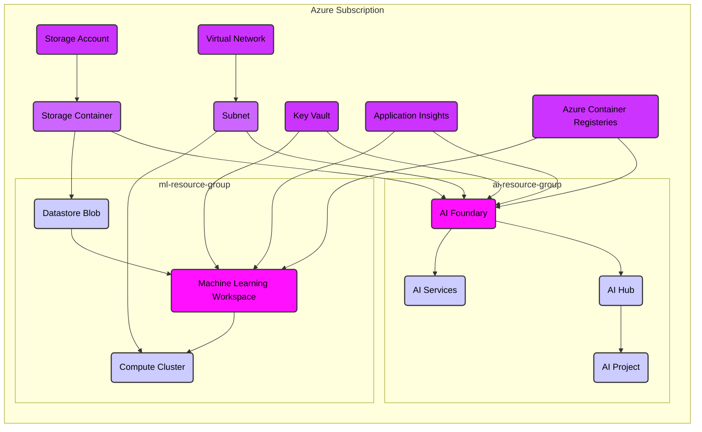

## Terraform Azure Machine Learning Project

This project uses Terraform to provision and manage Azure Machine Learning resources. The configuration includes setting up a machine learning workspace, compute clusters, storage containers, AI foundary environment and other necessary resources.

### Project Structure

```
.
├── .gitignore
├── .terraform/
│   ├── *Terraform-Files*
├── .terraform.lock.hcl
├── az-environment
├── azureai.tf
├── main.tf
├── mlworkspace.tf
├── outputs.tf
├── providers.tf
└── variables.tf
```

### Files Description
<b>providers.tf</b>: The providers.tf file is crucial for configuring the required providers and setting up the Azure provider with necessary credentials and features.

> #### Key Sections:
> + <b>Required Providers</b>: Specifies the providers required for the Terraform configuration, including azurerm, azapi, and random.
> + <b>Backend Configuration</b>: Configures the remote backend for storing the Terraform state, including the hostname, organization, and workspace name.
> + <b>Provider Configuration</b>: Sets up the Azure provider with placeholders for tenant ID, subscription ID, client ID, and client secret. It also includes feature configurations for key vault, resource group, and machine learning.

<b>main.tf</b>: The main.tf file serves as the main entry point for the Terraform configuration. It orchestrates the creation and management of various Azure resources required for the Azure Machine Learning environment. This file typically includes the high-level resource definitions and references to other configuration files.

> #### Key Sections:
> + <b>Resource Definitions</b>: Specifies the Azure resources to be created, such as virtual networks, subnets, and other infrastructure components.
> + <b>Modules</b>: References to reusable modules that encapsulate specific functionality or resource configurations.
> + <b>Data Sources</b>: Defines data sources to fetch information about existing resources in your Azure environment.
> + <b>Dependencies</b>: Establishes dependencies between resources to ensure they are created in the correct order.

<b>azureai.tf</b>: The azureai.tf file defines the resources for Azure AI hub and projects. This file includes the configuration for various Azure AI services and resources that are required for your machine learning projects.

> #### Key Sections:
> + <b>AI Hub Resources</b>: Specifies the Azure AI resources to be created, such as AI services, cognitive services, and other AI-related infrastructure components.
> + <b>Project Configuration</b>: Defines the settings and parameters for individual AI projects, including resource groups, locations, and specific AI services.

<b>mlworkspace.tf</b>: The mlworkspace.tf file defines the resources for the Azure Machine Learning workspace, compute instances, and storage containers. This file includes the configuration necessary to set up and manage the core components of your Azure Machine Learning environment.

> #### Key Sections:
> + <b>Machine Learning Workspace</b>: Defines the Azure Machine Learning workspace, which serves as the central hub for managing machine learning experiments, models, and deployments.
> + <b>Compute Instances</b>: Specifies the compute resources required for training and running machine learning models, such as virtual machines or compute clusters.
> + <b>Storage Containers</b>: Configures the storage accounts and containers used to store datasets, models, and other artifacts related to machine learning projects.

<b>variables.tf</b>: The variables.tf file contains variable definitions used throughout the Terraform configuration. This file allows you to define and manage input variables that can be used to customize the behavior of your Terraform scripts.

> #### Key Sections:
> + <b>Variable Definitions</b>: Specifies the variables that can be used in the Terraform configuration. Each variable can have a type, default value, and description.
> + <b>Default Values</b>: Provides default values for variables, which can be overridden by user-defined values in a terraform.tfvars file or through command-line arguments.

<b>outputs.tf</b>: The outputs.tf file defines the outputs of the Terraform configuration. Outputs are used to display information about the resources created by the Terraform configuration, which can be useful for debugging, integration with other systems, or simply to provide useful information to the user.

> #### Key Sections:
> + <b>Output Definitions</b>: Specifies the outputs that will be displayed after the Terraform configuration is applied. Each output can have a name, value, and description.


### Template Files
The project includes template files for the <b>providers.tf</b> and variables.tf</b> configurations. These templates need to be customized with your specific Azure credentials and settings.

<b>providers.tf.template</b>: Template for the providers.tf file. Copy this file to <b>providers.tf</b> and replace the placeholder values with your actual Azure credentials.
<b>variables.tf.template</b>: Template for the variables.tf file. Copy this file to <b>variables.tf</b> and replace the placeholder values with your specific configuration values.

### Architecture



### Prerequisites
+ Terraform v1.1.0 or higher
+ Azure CLI
+ Azure subscription

### Setup
1. Clone the repository:
```sh
git clone <repository-url>
cd <repository-directory>
```
2. Configure Azure CLI:
```sh
az login
```
3. Create a <b>terraform.tfvars</b> file with the following content:
```sh
ARM_TENANT_ID       = "<your-tenant-id>"
ARM_SUBSCRIPTION_ID = "<your-subscription-id>"
ARM_CLIENT_ID       = "<your-client-id>"
ARM_CLIENT_SECRET   = "<your-client-secret>"
```
4. Copy and customize the template files:
```sh
cp providers.tf.template providers.tf
cp variables.tf.template variables.tf
```
5. Edit <b>providers.tf</b> and <b>variables.tf</b> to replace placeholder values with your actual Azure credentials and configuration values.
6. Initialize Terraform:
```sh
terraform init
```
7. Apply the Terraform Configuration
```sh
terraform apply
```
